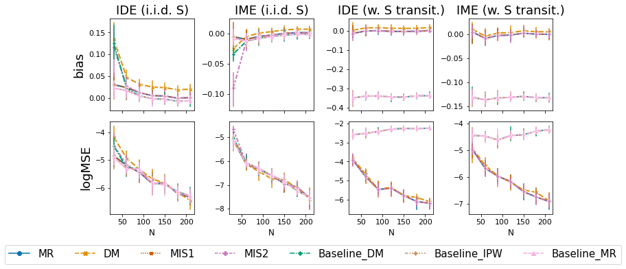
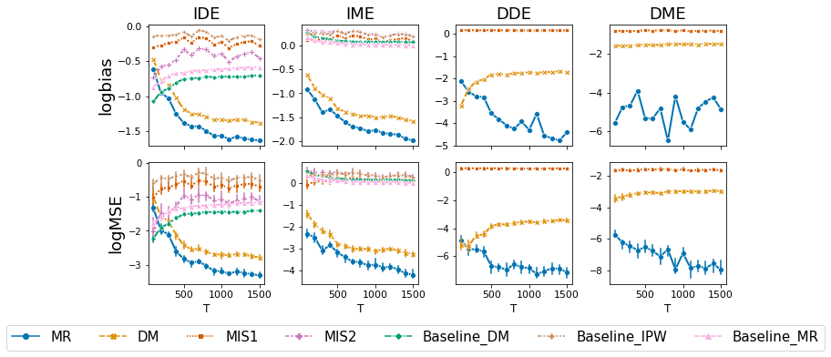
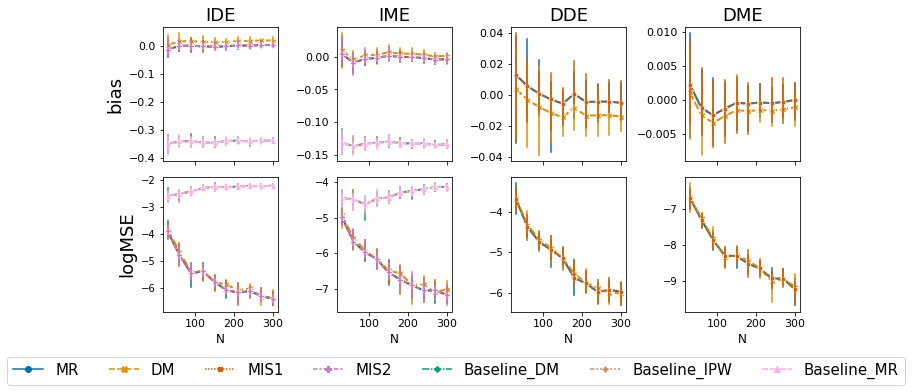
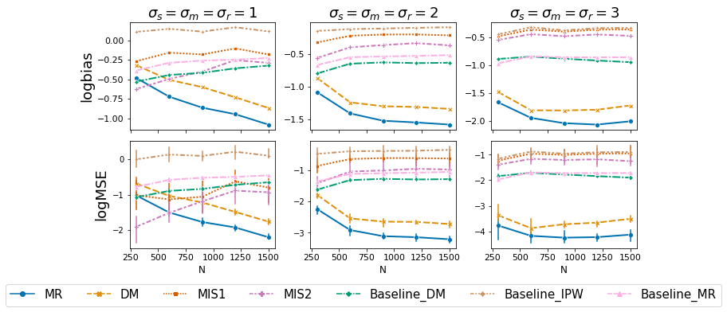
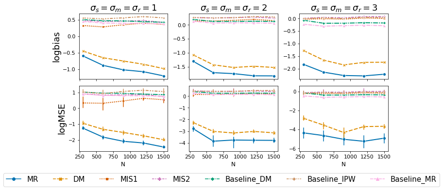
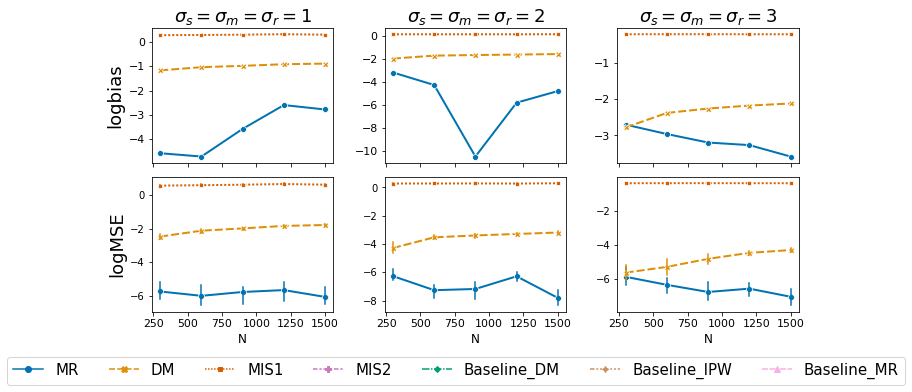
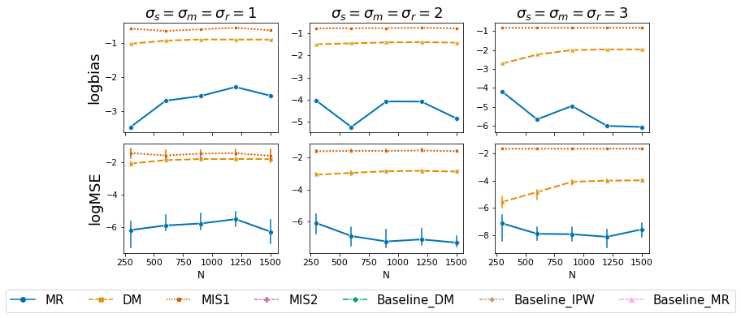
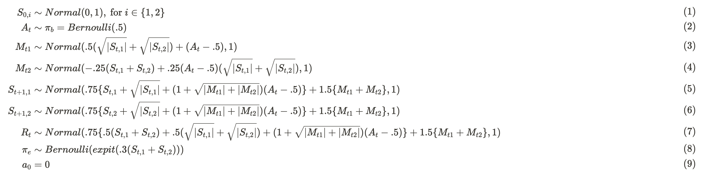
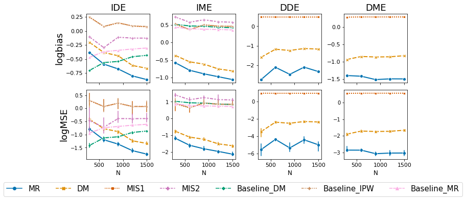
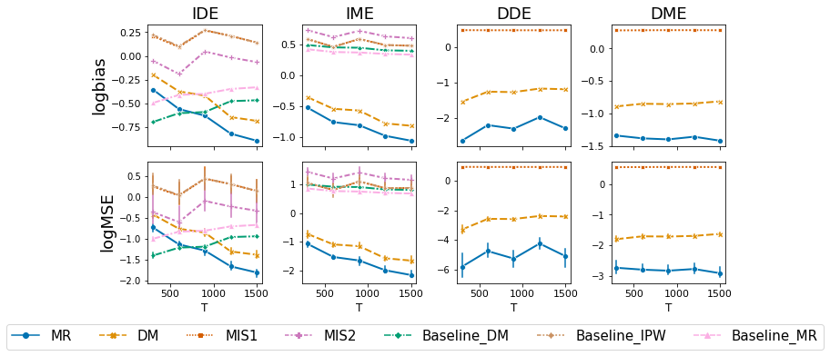

# Dynamic Mediation Analysis-Rebuttal

## A. Updated Results for Sec 7.2 and Sec 7.3 with Additional Baseline Methods

In this section, we consider two additional baselines for both the IDE and IME, including the inverse probability weighting estimators (denoted as Baseline_IPW) proposed in [1,2] and the multiply robust estimators (denoted as Baseline_MR) proposed in [3]. Figures below are the corresponding updated version for Figure 4, 5 and 6 in our paper, with results of the two additional baseline estimators. We denote the original baseline estimator in the paper as Baseline_DM.

### 7.2 Toy Example II
<figure>
  
  <figcaption>Figure 4: Bias and the logMSE of estimators, under different data generation scenarios. The results are aggregated over 200 random seeds.</figcaption>
</figure>

### 7.3 Semi-Synthetic Data
<figure>
  
  <figcaption>Figure 5: The logbias and logMSE of various estimators, aggregated over 100 random seeds. The error bars represent the 95% CI. Fix T = 25.</figcaption>
</figure>

<figure>
  
  <figcaption>Figure 6: The logbias and logMSE of various estimators, aggregated over 100 random seeds. The error bars represent the 95% CI. Fix N = 50.</figcaption>
</figure>

### Summary

Overall, the performance of all three baseline estimators is similar in that they continue to yield biased estimates with non-decreasing MSE.

## B. Additional Empirical Evaluation

In this section, we conduct addition three sets of experiments to demostrate the empirical performance of our method.

### I. Discrete Variable Spaces

We investigate the estimation performance under the settings with discrete variable spaces (i.e., settings of the toy example). The results are shown in Figure B.1. Similar to what we concluded from the semisynthetic simulation in Section 7.3, all three sets of the proposed estimators provide unbiased estimation for all four effect components, with the MSE decreasing continuously as the sample size increases. In contrast, baseline estimators ignoring the fact of state transition continue to yield biased estimates no matter how large the sample size is.

<figure>
  
  <figcaption>Figure B.1: The logbias and logMSE of various estimators under the setting with discrete spaces. The results are aggregated over 200 random seeds.</figcaption>
</figure>

### II. Impact of Variance on Performance

Under semi-synthetic data settings, we further explore the estimation performance when the variances of variables change. Specifically, we add two additional settings where the standard deviation of the random noise of state, mediator, and reward takes values of 1 and 3, i.e., $\sigma_m = \sigma_s =  \sigma_r = 1$ and $\sigma_m = \sigma_s = \sigma_r = 3$.  The setting where $\sigma_m = \sigma_s = \sigma_r = 2$ has been investigated in the original paper.

Regardless of the size of the variances, the proposed MR estimators always provide the most accurate estimation with the smallest bias and MSE. While MIS and baseline estimators continue to provide biased estimates with non-decreasing MSE, the difference between DM and MR estimators becomes smaller as variance increases. The results are shown in Figure B.2 to Figure B.5.

<figure>
  
  <figcaption>Figure B.2: logBias and the logMSE of estimators for IDE, under different data generation scenarios. Fix T = 50.</figcaption>
</figure>

<figure>
  
  <figcaption>Figure B.3: logBias and the logMSE of estimators for IME, under different data generation scenarios. Fix T = 50.</figcaption>
</figure>

<figure>
  
  <figcaption>Figure B.4: logBias and the logMSE of estimators for DDE, under different data generation scenarios. Fix T = 50.</figcaption>
</figure>

<figure>
  
  <figcaption>Figure B.5: logBias and the logMSE of estimators for DME, under different data generation scenarios. Fix T = 50.</figcaption>
</figure>

### III. Multidimensional State and Mediator

We investigate the estimation performance in a more complex setting where both the state and mediator are multidimensional. Specifically, we set the number of state variables to be 2 and the number of mediators to be 2. The data generating mechanism is shown below.

<figure>
  
</figure>

 The results demonstrate the same trend observed in the semi-synthetic simulation in section 7.3. The results are shown in Figure C.1 and C.2.
<figure>
  
  <figcaption>Figure C.1: logBias and the logMSE of estimators, under settings with multidimensional state. Fix T = 100.</figcaption>
</figure>

<figure>
  
  <figcaption>Figure C.2: logBias and the logMSE of estimators, under settings with multidimensional state. Fix N = 100.</figcaption>
</figure>

## Scripts to Conduct Experiments

1. `/Toy2`: There are additional code files used to generate results for the two baseline estimators for toy example 2. `toy_example_iid_base.py` and  `toy_example_w_S_base.py` are the corresponding experiment script. Furthermore, an updated experiment script, `toy_example_w_S.py`, generates the estimation results for DDE and DME, which is summarized in Figure B.1.
2. `/Semi_Synthetic`: Additional code files used to generate results for the two baseline estimators for semi-synthetic experiments. `estimate_Baseline.py` and `estimate_T_Baseline.py` are the corresponding experiment scripts.
3. `/Variance_Impact`: There are all code files used for the additional experiment investigating the impact of the variance of random noise of state/mediator/reward on the estimation performance. Results are summarized in Figure B.2 to Figure B.5. 
4. `/Multidimensional_State_Mediator`: There are all code files used for the additional experiment investigating the estimation performance under a more complex setting with multidimensional states and mediators. Results are summarized in Figure C.1 and C.2. 

## References

[1]Lange, T., Vansteelandt, S., \& Bekaert, M. (2012). A simple unified approach for estimating natural direct and indirect effects. American journal of epidemiology, 176(3), 190-195.

[2]Hong, G. (2010). Ratio of mediator probability weighting for estimating natural direct and indirect effects. In Proceedings of the American Statistical Association, biometrics section (pp. 2401-2415).

[3] Tchetgen, E. J. T., \& Shpitser, I. (2012). Semiparametric theory for causal mediation analysis: efficiency bounds, multiple robustness, and sensitivity analysis. Annals of statistics, 40(3), 1816.
